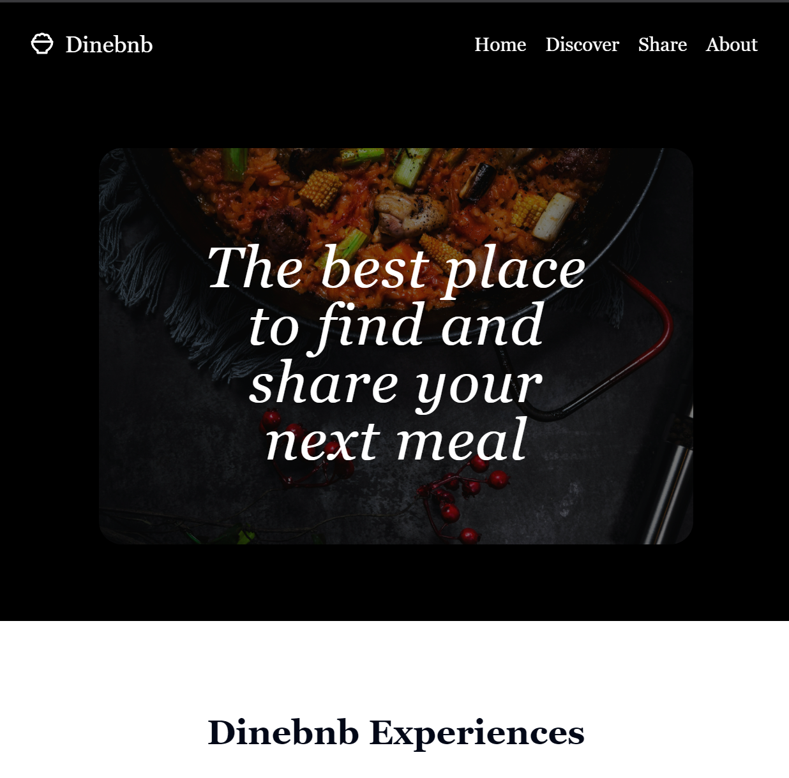

# Dinebnb / DDD-EateryApp

Welcome to the Restaurant Sharing App! This application allows users to share their favorite restaurants and view restaurant locations on an interactive map. The app was built with a focus on scalability and maintainability using Domain-Driven Design (DDD).

<!--  -->


## Key Features

- **Domain-Driven Design (DDD)**: The application architecture is carefully designed to separate concerns and align with business needs.
- **Interactive Map**: Users can see restaurant locations on a map and interact with them.
- **Scalable Backend**: Built with Node.js, TypeScript, and MongoDB.
- **Dynamic Frontend**: Developed using React, Tailwind CSS, and ShadCN UI.

## Directory Structure

### Frontend

#### Structure:

```
frontend/
  src/
    components/
      Header/
      Footer/
      Map/
    pages/
    utils/
```

#### Technologies:

- React
- Tailwind CSS
- Vite
- ShadCN UI
- Storybook

The frontend is responsible for the user interface, providing a seamless and interactive experience. For more details, refer to the [Frontend README](./frontend/README.md).

### Backend

#### Structure:

```
backend/
  src/
    domain/
    application/
    infrastructure/
    presentation/
```

#### Technologies:

- Node.js
- TypeScript
- Express.js
- MongoDB
- Mongoose
- Jest

The backend handles business logic, data persistence, and communication with the frontend. For more details, refer to the [Backend README](./backend/README.md).

## How to Get Started

1. Clone the repository:

   ```bash
   git clone <repository-url>
   ```

2. Navigate to the frontend and backend directories to set up and run the development servers as described in their respective READMEs.

3. Enjoy exploring and contributing to the app!
